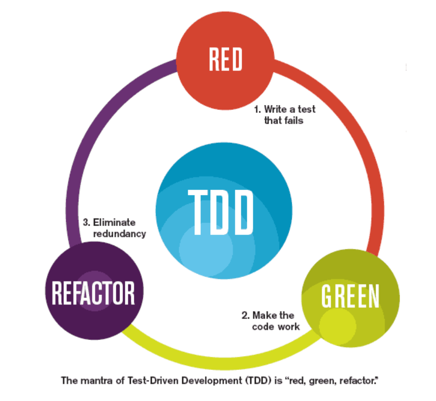

<h1 align="center">
  
</h1>

# TDD - Test Driven Development

Turma Online 21 - Imersão JavaScript | Semana 1 | 2022 | Professora Letícia Luzia

### O que veremos na aula de hoje
 - [Introdução à Testes](#introdução-a-testes)
    - [O que são e para que servem ](#o-que-são-testes-e-para-que-servem)
    - [Abordagens](#abordagens)
    - [Tipos de teste](#tipos-de-teste)
    - [Sete princípios de teste de software](#sete-princípios-de-teste-de-software)
    - [Ferramentas](#ferramentas)  
  
  - [Testes Unitarios](#testes-unitarios)
    - [O que são e para que servem](#o-que-são-testes-unitários-e-para-que-servem)
    - [Beneficios](#benefícios-dos-testes-unitários)
    - [Implementação](#implementação-de-testes-unitários)

  - [TDD: Test Driven Development](#tdd-test-driven-development)
    - [O que é e para que serve](#o-que-é-tdd-e-para-que-servem)
    - [Beneficios](#benefícios-do-tdd)
    - [Implementação](#implementação-do-tdd)

  - [Exercícios](#exercícios)
  - [Material da aula](#material-da-aula)
  - [Links Úteis](#links-úteis)

### Combinados
* Quando falar, levante a mão no Zoom
* Mantenha seu microfone desligado quando não estiver interagindo
* Se possível, mantenha a câmera ligada para nos conhecermos :)

### Instruções
Antes de começar, vamos organizar nosso setup.
* Fork esse repositório 
* Clone o fork na sua máquina (Para isso basta abrir o seu terminal e digitar `git clone url-do-seu-repositorio-forkado`)
* Entre na pasta do seu repositório (Para isso basta abrir o seu terminal e digitar `cd nome-do-seu-repositorio-forkado`)
* Altere o nome da pasta "nome-aluna" para o seu nome-sobrenome, este é o único local onde você deve realizar alterações
# Conteúdo

## Introdução a Testes  

#### O que são testes e para que servem
O teste de software é o processo de avaliação e verificação de que um produto de software ou aplicativo faz o que deveria fazer. Os benefícios do teste incluem a prevenção de bugs, a redução dos custos de desenvolvimento e a melhoria do desempenho.

#### Quais problemas podemos evitar com a implementação de testes?
Quanto mais cedo as equipes de desenvolvimento receberem feedback de teste, mais cedo elas poderão resolver problemas como:

- Falhas arquitetônicas
- Decisões de design ruins
- Funcionalidade inválida ou incorreta
- Vulnerabilidades de segurança
- Problemas de escalabilidade

#### Abordagens
**Teste Caixa Branca**

Também é chamado de Caixa de Vidro, Caixa Transparente, Teste Estrutural. As técnicas de teste de caixa branca como estruturas internas, como estruturas de dados usadas, ou design interno, estrutura de código e funcionamento do software.

**Teste de Caixa Preta**

Também é chamado de Teste Comportamental, Baseado em Especificações e Teste de Entrada-Saída. O teste de caixa preta é um tipo de teste de software no qual a funcionalidade do software não é conhecida, os testadores avaliam a funcionalidade do software em teste sem olhar para a estrutura interna do código.

**Teste de Caixa Cinza** 
Esse tipo de teste une os dois anteriores, por isso o termo "cinza". Avalia tanto os aspectos internos quanto os externos, de entrada e saída.

#### Tipos de teste
- Principais:
    - Testes Unitários: Valida se cada unidade de software funciona conforme o esperado. Uma unidade é o menor componente testável de um aplicativo;
    - Testes de Integração: Valida se as unidades do sistema funcionam juntas, integradas. Pode ocorrer delas apresentarem incompatibilidades ao funcionarem em conjunto, mesmo após terem sido aprovadas no teste de unidade;
    - Testes Ponta a Ponta (End-to-End, E2E): Valida o sistema de ponta a ponta, para garantir que o software funcione em todos os sistemas de destino pretendidos;
    - Testes de aceitação: Valida a aprovação do clientes. Os tipos de testes de aceitação são testes alfa, beta e gama;

#### Sete princípios de teste de software

**1. Teste demonstra a presença de defeitos**

"O teste fala sobre a presença de defeitos e não fala sobre a ausência de defeitos". O objetivo do teste de software é fazer com que o software falhe. O teste de software reduz a presença de defeitos, mas não pode garantir que o software esteja 100% livre de bugs.

**2. Teste exaustivo é impossível**

O processo de testar a funcionalidade do software em todas as entradas e pré-condições possíveis - válidas ou inválidas - é conhecido como teste exaustivo. O teste exaustivo é impossível porque o software nunca pode testar em todos os casos de teste, isso demandaria mais custo, tempo, esforço, etc., o que é impraticável. O que fazemos é testar apenas alguns casos de teste e assumir que o software está correto e produzirá a saída correta em todos os casos de teste.

**3. Teste antecipado**

Incorporar o teste o mais cedo possível no processo de desenvolvimento. Ele desempenha um papel crítico no ciclo de vida de desenvolvimento de software, quanto mais cedo bugs forem identificados mais barato e fácil será a correção.

**4.  Agrupamento de defeitos**

Em um projeto, um pequeno número de módulos pode conter a maioria dos bugs. O Princípio de Pareto (Regra 80-20) para teste de software afirma que 80% do defeito de software vem de 20% dos módulos

**5. Paradoxo do Pesticida**

Repetir os mesmos casos de teste, repetidamente, não encontrará novos bug. É necessário revisar os casos de teste, e adicionar ou atualizar os casos de teste para encontrar novos bugs.

**6. Teste depende do contexto**

A abordagem de teste depende do contexto do software desenvolvido. Diferentes tipos de software precisam realizar diferentes tipos de teste.

**7. A ilusão da ausência de erros**

Se um software construído é 99% livre de bugs, mas não segue o atende às expectativas e necessidades do usuário, então ele é inutilizável.

#### Ferramentas
**Jest**
<h6 align="center">
  
</h6>
Famosa e uma das mais utilizadas ferramentas de testes unitários para o ecossistema Javascript. Criado inicialmente para realizar testes em React, hoje é utilizado também para testar unidades no backend (Node).
<a href="https://jestjs.io/pt-BR/">Documentação</a>


**Cypress**
<h6 align="center">
  
</h6>
Ferramenta de testes mais robusta, muito utilizado para automatizar testes no front-end e para testes E2E.
<br>
<a href="https://www.cypress.io/">Documentação</a>

## Testes Unitários
   #### O que são testes unitários e para que servem
   Teste unitário verifica o comportamento de uma unidade de um programa. Nesse caso unidade pode ser considerada um pedaço pequeno e isolado do código, como por exemplo um método ou função.
   Valida se esta unidade continuará funcionando caso sofra uma alteração, promovendo um crescimento saudável do sistema, independente de quanto ele crescer.

   #### Benefícios dos testes unitários
   - Ajudam a encontrar e resolver bugs de maneira rápida e fácil;
  - Contribuem para uma maior qualidade de código;
  - Guiam para melhores arquiteturas de aplicação;
  - Podem ser utilizadas como documentação;
  - São focados em pequenas unidades, o que permite erros mais nítidos quando em comparação com outros tipos de teste;
  - São rápidos e por isso podem ser executados com constância com baixo custo de processamento.

   #### Implementação de testes unitários
   Um bom teste unitário deve seguir o F.I.R.S.T.:

  - Rápido (Fast): Projetos grandes costumam ter muitos testes, tempo é dinheiro.
  - Isolado (Isolated): Um teste unitário deve ser executado isoladamente, sem comunicações com sistemas externos ou bancos de dados.
  - "Repetível" (Repeatable): Sua execução deve ter resultados consistentes caso não haja nenhuma alteração.
  - "Auto-verificável" (Self-validating): O teste deve ser capaz de detectar de maneira automática se passou ou falhou.
  - Minucioso (Thorough): Cobrir caminho felizes, infelizes, casos raros (edge cases)

  E ainda:

  - Simples: Teste devem ser fáceis de implementar e ler, sem repetição do código da função testada.
  - Oportuno: A escrita de um teste não deve demorar mais que a escrita do código testado.

  ```js
  // Considere que serão utilizados apenas valores numéricos
  function add(a, b) {
      return a + b;
  }

  fuction mul(a, b) {
      return a * b;
  }

  function sub(a, b) {
      return a - b;
  } 

  function div(a, b) {
      a / b;
  } 

  describe("Arithmetic functions", () => {
      test('2 + 3 = 5', () => {
          expect(add(2, 3)).toBe(5);
      });

      test('3 * 4 = 12', () => {
          expect(mul(3, 4)).toBe(12);
      });

      test('5 - 6 = -1', () => {
          expect(sub(5, 6)).toBe(-1);
      });

      test('8 / 4 = 2', () => {
          expect(div(8, 4)).toBe(2);
      });
  });
  
  ```

## TDD: Test Driven Development
   #### O que é TDD e para que serve
   TDD é a sigla para *Test Driven Development*, que significa Desenvolvimento Orientado por Testes. Nessa metodologia de desenvolvimento de software a codificação dos testes unitários acontece antes da codificação das funcionalidades. Na prática, utilizar TDD, ajuda a ter mais segurança ao desenvolver do zero e fazer alterações, pois o feedback de erro (ou acerto) é mais rápido.

   #### Benefícios do TDD
  - Aumenta segurança ao realizar alterações no código por conta do feedbeck rápido;
  - Menos bugs - o código é feito para funcionar - isso promove menor tempo na depuração e correção;
  - Promove código mais simples e bem estruturado;
  - Reforça a cultura de qualidade de software.

   #### Implementação do TDD
  O TDD é dividido em três fases: Vermelho (Red), Verde (Green) e Refatoração (Refactor). Passo a passo:

  1. Escrevemos um teste para a funcionalidade que ainda será implementada. Como ela não existe, caso o teste seja executado ele deve resultar em erro, ou seja, vermelho!
  2. Escrevemos a funcionalidade, e executamos o teste, agora ele deve funcionar, isso é o verde.
  3. Se a funcionalidade e o teste funcionam, devemos buscar (se possível) melhorar o que foi codificado. As modificações podem fazer com que o teste falhe, a refatoração deve durar até o teste voltar a funcionar.

  <h6 align="center">
  
</h6>

***
### Exercícios 
* [Exercicio para sala](/exercicios/para-sala/)
* [Exercicio para casa](/exercicios/para-casa/)

### Material da aula 
* [Material](/material)

### Links Úteis
* [Testes de software: Introdução, conceitos básicos e tipos de testes](https://blog.onedaytesting.com.br/teste-de-software/)
* [Os sete princípios do teste](https://medium.com/@marcio_rc/os-sete-princ%C3%ADpios-do-teste-de954ae080d0)
* [Entenda de uma vez por todas o que são testes unitários, para que servem e como fazê-los](https://dayvsonlima.medium.com/entenda-de-uma-vez-por-todas-o-que-s%C3%A3o-testes-unit%C3%A1rios-para-que-servem-e-como-faz%C3%AA-los-2a6f645bab3)
* [Entendendo e aplicando o Test Driven Development (TDD)](https://blog.onedaytesting.com.br/test-driven-development/)
* [O que é TDD?](https://dev.to/womakerscode/o-que-e-tdd-4b5f)

***

### Contato
[E-mail](mailto:leticialuzia89@gmail.com)
[Linkedin](https://www.linkedin.com/in/leticialuzia/)

<p align="center">
Desenvolvido com :purple_heart:  
</p>

